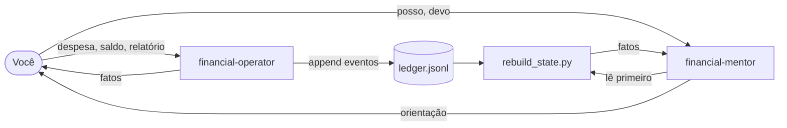
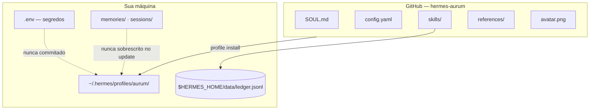
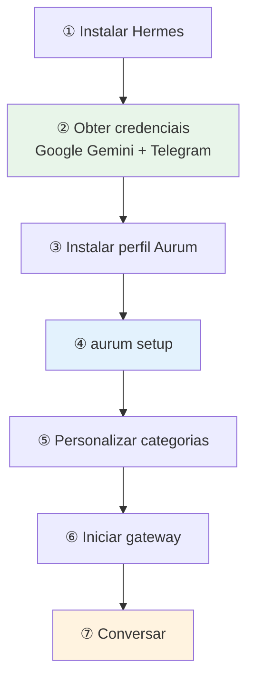

<p align="center">
  
</p>

<h1 align="center">Aurum</h1>

<p align="center">
  <strong>Agente de finanças pessoais para Hermes</strong><br/>
  Ledger event-sourced · patrimônio derivado · mentoria sob demanda
</p>

<p align="center">
  <a href="ROADMAP.md"></a>
  <a href="https://github.com/NousResearch/hermes-agent"></a>
  <a href="LICENSE"></a>
</p>

<p align="center">
  Open source — livre para usar, fazer fork e contribuir.
</p>

---

**Conteúdo:** [O que é o Aurum](#o-que-é-o-aurum) · [Exemplo](#exemplo) · [Arquitetura](#arquitetura) · [Categorias](#categorias) · [Modelo de dados](#modelo-de-dados-jsonl) · [Scripts](#scripts-uso-direto) · [Roadmap](#ainda-não-implementado) · [Instalação](#instalação)

---

## O que é o Aurum?

O **Aurum** é um agente conversacional para o [Hermes Agent](https://github.com/NousResearch/hermes-agent). Você conversa via **CLI** ou **Telegram**; ele registra suas finanças e responde com base em fatos — nunca em suposições.

| Modo | Uso | Quando | Comportamento |
|:----:|:---:|--------|---------------|
| **Operador** | 90% | Lançamentos, saldos, relatórios | Apenas fatos. Sem opiniões. |
| **Mentor** | 10% | "Posso investir?", "Devo quitar a dívida?" | Orientação com base nos dados registrados |



### Filosofia

> O Aurum é um gestor financeiro baseado em eventos. Seu objetivo principal é registrar fielmente sua atividade financeira, reconstruir seu patrimônio a qualquer momento e oferecer orientação financeira com base exclusivamente nos dados que você registrou.

### Regra de ouro

| Princípio | Significado |
|-----------|-------------|
| **Sem saldos armazenados** | Saldos nunca são verdade absoluta em disco |
| **Patrimônio derivado** | Sempre reconstruído a partir do histórico de eventos |
| **Ledger append-only** | Correções usam eventos `adjustment` — nunca edição de linhas |

## Exemplo

<table>
<tr>
<td width="50%">

**Você**

```
Gastei R$ 52,30 no mercado pelo Inter.
```

</td>
<td width="50%">

**Aurum** *(operador)*

```
✓ Registrado.
✓ Saldo do Inter atualizado.
✓ Fluxo de caixa atualizado.
✓ Categoria: Alimentação.
```

</td>
</tr>
<tr>
<td>

```
Quanto tenho disponível?
```

</td>
<td>

Executa `rebuild_state.py` — fatos do ledger.

</td>
</tr>
<tr>
<td>

```
Posso investir R$ 5.000 em BTC?
```

</td>
<td>

*(mentor)* Fatos + análise qualificada, com ressalvas.

</td>
</tr>
</table>

## Arquitetura

Este repositório é uma [distribuição de perfil Hermes](https://hermes-agent.nousresearch.com/docs/user-guide/profile-distributions). `hermes profile install` copia para `~/.hermes/profiles/aurum/` e cria o comando `aurum`.



| Componente | Função |
|------------|--------|
| `SOUL.md` | Persona e regras de comportamento |
| `config.yaml` | Modelo, toolsets, memória |
| `skills/` | `financial-operator` + `financial-mentor` |
| `references/` | Lista de categorias e seed do ledger |
| `avatar.png` | Foto sugerida para o bot no Telegram |

| No GitHub | Só local |
|-----------|----------|
| Skills, SOUL, config, categorias | API keys, tokens de bot |
| | Ledger, memórias, sessões |

## Estrutura do repositório

```
hermes-aurum/
├── avatar.png           # foto do bot (ver Instalação)
├── README.md
├── ROADMAP.md
├── distribution.yaml
├── SOUL.md
├── config.yaml
├── references/
│   ├── categories.json
│   └── ledger.seed.jsonl
└── skills/
    ├── financial-operator/
    │   ├── SKILL.md
    │   └── scripts/
    │       ├── aurum-run      # entrada única (hint, do, legado)
    │       ├── catalog.py     # catálogo de intenções
    │       ├── do.py          # dispatcher hint/help/do
    │       ├── ledger.py
    │       ├── rebuild_state.py
    │       ├── reports.py
    │       └── backup.py
    └── financial-mentor/
        └── SKILL.md
```

## Categorias

O operador mapeia sua linguagem para strings **exatas** em `references/categories.json`. O `ledger.py` rejeita qualquer coisa fora da lista.

Categorias padrão em **pt-BR**:

```json
{
  "expense": ["Alimentação", "Transporte", "Moradia", "Saúde", "Lazer", "Educação", "Vestuário", "Outros"],
  "income": ["Salário", "Freelance", "Investimentos", "Outros"]
}
```

Mantenha as chaves `expense` e `income`. Não precisa reiniciar o gateway.

## Intenções vs comandos legados (v1.4+)

O agente usa **`aurum-run`** como ponto de entrada. Preferência por intenções; comandos legados continuam disponíveis.

| Ação | Comando recomendado |
|------|---------------------|
| Não sabe o comando | `aurum-run hint "<pergunta do usuário>"` |
| Catálogo completo | `aurum-run help --json` |
| Listar contas | `aurum-run do list-accounts` |
| Despesas do mês | `aurum-run do monthly-report` |
| Saldo / patrimônio | `aurum-run do balances` |
| Registrar despesa | `aurum-run do record-expense '<json>'` |
| Transferência | `aurum-run do record-transfer '<json>'` |
| Pagamento misto | `aurum-run do record-mixed-expense '<json>'` |
| Nova categoria / conta | `aurum-run do add-category` / `add-account` |

Legado: `aurum-run report …`, `aurum-run ledger …`, `aurum-run state`.

**Versionamento:** incremente `distribution.yaml` a cada release, crie a tag Git `vX.Y.Z` e veja o fluxo completo em [docs/versioning.md](docs/versioning.md).

## Backup

Backup diário do ledger no servidor: [docs/backup.md](docs/backup.md) (`bkp/aurum-YYYYMMDD.tar.gz`, cron às 03:00).

## Modelo de dados (JSONL)

Cada linha é um evento independente — o ledger é reconstruído a partir deste arquivo:

```jsonl
{"type":"account","name":"Banco Inter","kind":"asset"}
{"type":"expense","date":"2026-06-10","account":"Banco Inter","category":"Alimentação","amount":52.30,"description":"Mercado"}
{"type":"income","date":"2026-06-10","account":"Banco Inter","category":"Salário","amount":5000}
{"type":"transfer","date":"2026-06-10","from":"Banco Inter","to":"Carteira","amount":100}
{"type":"investment","date":"2026-06-10","account":"Banco Inter","asset":"BTC","amount":500}
{"type":"adjustment","date":"2026-06-10","account":"Carteira","amount":15,"reason":"Contagem física"}
```

| Tipo | Finalidade |
|------|------------|
| `account` | Registrar carteira ou conta bancária |
| `expense` / `income` | Saída ou entrada de dinheiro |
| `transfer` | Entre suas contas |
| `investment` | Compra/manutenção de ativo |
| `liability` | Acompanhamento de dívida |
| `adjustment` | Correção de contagem física (valor com sinal) |

## Scripts (uso direto)

```bash
SCRIPT="skills/financial-operator/scripts"

python3 "$SCRIPT/ledger.py" append '{"type":"expense","date":"2026-06-10","account":"Banco Inter","category":"Alimentação","amount":52.30,"description":"Mercado"}'
python3 "$SCRIPT/rebuild_state.py"
python3 "$SCRIPT/reports.py" monthly --month 2026-06
```

## Implementado (MVP v1.0)

- [x] Ledger JSONL append-only
- [x] Operador financeiro (lançamentos, categorização, relatórios)
- [x] Mentor financeiro (sob demanda)
- [x] Reconstrução de estado a partir do histórico
- [x] Validação de conta e categoria no append
- [x] Escritas atômicas (`flush` + `fsync`)
- [x] Auto-init na primeira escrita
- [x] Eventos: account, expense, income, transfer, investment, liability, adjustment

## Ainda não implementado

Veja [ROADMAP.md](ROADMAP.md) para planos futuros detalhados.

---

## Instalação

Tudo acima é **o que** o Aurum é. Abaixo está **como** executar — siga os passos em ordem.

### Visão geral



> **Clone não é obrigatório.** `hermes profile install` baixa do GitHub. Clone só para desenvolver ou editar o repositório diretamente.

### Antes de começar

| Requisito | Onde obter | Passo |
|-----------|------------|-------|
| Hermes Agent | [script de instalação](https://hermes-agent.nousresearch.com) | ① |
| Chave API Google Gemini | [aistudio.google.com/apikey](https://aistudio.google.com/apikey) | ②a |
| Token do bot Telegram | [@BotFather](https://t.me/BotFather) | ②b |
| ID de usuário Telegram | [@userinfobot](https://t.me/userinfobot) | ②c |
| Python 3.10+ | Sistema / instalador Hermes | — |

---

### ① Instalar Hermes

```bash
curl -fsSL https://hermes-agent.nousresearch.com/install.sh | bash
hermes doctor
```

---

### ② Obter credenciais

Faça isso **antes** do `aurum setup` — no celular e no navegador em paralelo.

#### ②a Chave API Google Gemini

1. Entre no [Google AI Studio](https://aistudio.google.com)
2. [Crie uma API key](https://aistudio.google.com/apikey) → copie a chave

O tier gratuito cobre Flash / Flash-Lite para uso leve; habilite billing em um projeto GCP separado para uso diário no Telegram.

#### ②b Bot Telegram (BotFather)

1. Abra [@BotFather](https://t.me/BotFather)
2. `/newbot` → nome de exibição (ex.: `Aurum`) → username terminando em `bot`
3. Copie o **token da API** (`123456789:ABCdef...`)

**Defina o avatar** — envie `avatar.png` deste repositório:

1. `/setuserpic` → selecione seu bot → envie `avatar.png`

Opcional:

| Comando | Finalidade |
|---------|------------|
| `/setdescription` | "Ledger de finanças pessoais no Telegram" |
| `/setabouttext` | Texto curto do perfil |
| `/setcommands` | `/help`, `/new`, etc. |

> Token vazado: `/revoke` no BotFather.

#### ②c ID de usuário Telegram

1. Envie mensagem para [@userinfobot](https://t.me/userinfobot)
2. Copie o ID **numérico** (não o `@username`)

**Checkpoint** — três valores prontos:

```bash
GOOGLE_API_KEY=...
TELEGRAM_BOT_TOKEN=123456789:ABCdef...
TELEGRAM_ALLOWED_USERS=123456789
```

---

### ③ Instalar o agente Aurum

Cria `~/.hermes/profiles/aurum/` e a CLI `aurum`:

```bash
hermes profile install github.com/laerciocrestani/hermes-aurum --alias -y
hermes profile info aurum
aurum doctor
```

**Desenvolvedores** (clone local):

```bash
git clone https://github.com/laerciocrestani/hermes-aurum.git
cd hermes-aurum
hermes profile install "$(pwd)" --alias -y
```

Atualizações (ledger e memórias preservados):

```bash
hermes profile update aurum
```

---

### ④ Configurar (`aurum setup`)

```bash
aurum setup
```

| Configuração | Origem |
|--------------|--------|
| `GOOGLE_API_KEY` | Passo ②a (ou `~/.hermes/.env` compartilhado) |
| `TELEGRAM_BOT_TOKEN` | Passo ②b |
| `TELEGRAM_ALLOWED_USERS` | Passo ②c |

Ou edite `~/.hermes/profiles/aurum/.env` manualmente.

Modelo padrão em `config.yaml`:

```yaml
model:
  default: gemini-2.5-flash-lite
  provider: gemini
  base_url: https://generativelanguage.googleapis.com/v1beta

fallback_providers:
  - provider: gemini
    model: gemini-2.5-flash
```

Alterar depois: `aurum model` · `aurum config set model.default <slug>`

---

### ⑤ Personalizar categorias

Edite `~/.hermes/profiles/aurum/references/categories.json` — veja [Categorias](#categorias).

---

### ⑥ Iniciar o gateway Telegram

```bash
aurum gateway start
```

Como serviço em background:

```bash
aurum gateway install && aurum gateway start && aurum gateway status
```

Pulou o Telegram no ④? Execute `aurum gateway setup` primeiro.

Docs: [Gateway](https://hermes-agent.nousresearch.com/docs/user-guide/messaging) · [Telegram](https://hermes-agent.nousresearch.com/docs/user-guide/messaging/telegram)

#### ⑥b Aprovar pareamento (primeira conexão)

Com o gateway **rodando**, autorize-se no Telegram:

**No celular**

1. Abra o Telegram → **novo chat** com o bot que você criou
2. Envie `/start`
3. O bot responde com um código de pareamento (8 caracteres, ex.: `DTN4K8XP`)

**No terminal**

```bash
aurum pairing approve telegram DTN4K8XP
```

Substitua `DTN4K8XP` pelo código que o bot enviou. Códigos expiram em 1 hora.

```bash
aurum pairing list    # usuários pendentes + aprovados
```

> Se você configurou `TELEGRAM_ALLOWED_USERS` corretamente no passo ④, o pareamento pode ser dispensado — mas `/start` + approve é o fluxo mais seguro na primeira vez, quando o bot ainda não responde.

---

### ⑦ Usar o Aurum

| Canal | Comando / ação |
|-------|----------------|
| **CLI** | `aurum chat` |
| **Telegram** | Mensagem para o bot — ex.: "Gastei R$ 52,30 no mercado pelo Inter" |

A primeira transação cria `$HERMES_HOME/data/ledger.jsonl` automaticamente.

---

### Desenvolvimento: workflow com symlink

```bash
REPO="$(pwd)"
PROFILE="$HOME/.hermes/profiles/aurum"
mkdir -p "$PROFILE/skills"

ln -sf "$REPO/skills/financial-operator" "$PROFILE/skills/financial-operator"
ln -sf "$REPO/skills/financial-mentor" "$PROFILE/skills/financial-mentor"
ln -sf "$REPO/references" "$PROFILE/references"
cp "$REPO/SOUL.md" "$PROFILE/SOUL.md"
cp "$REPO/config.yaml" "$PROFILE/config.yaml"
```

---

## Contribuindo

1. Leia [ROADMAP.md](ROADMAP.md) antes de PRs grandes
2. Abra issues para funcionalidades futuras — não implemente em silêncio
3. Mantenha a regra de ouro: saldos derivados, nunca persistidos

## Licença

MIT — veja [LICENSE](LICENSE).

## Aviso legal

O Aurum **não** é consultoria financeira regulamentada. O modo mentor oferece orientação com base nos dados que você registrou, com ressalvas. Decisões financeiras são de sua responsabilidade.
