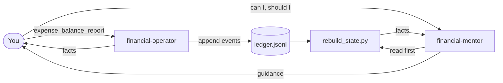
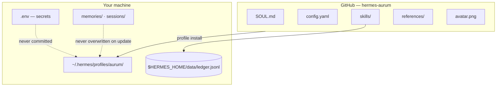
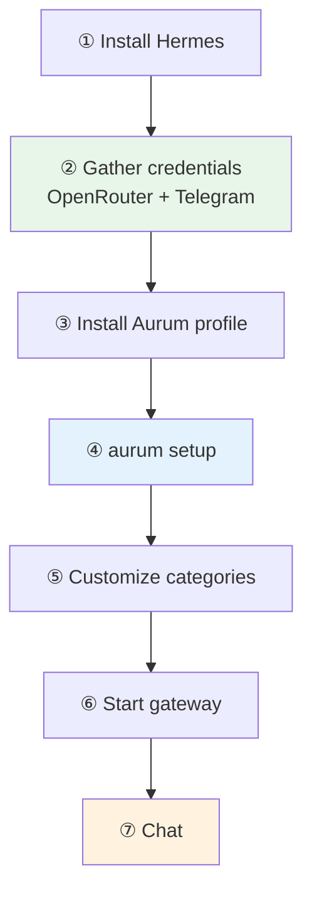

<p align="center">
  
</p>

<h1 align="center">Aurum</h1>

<p align="center">
  <strong>Personal finance agent for Hermes</strong><br/>
  Event-sourced ledger · derived net worth · mentoring on demand
</p>

<p align="center">
  <a href="ROADMAP.md"></a>
  <a href="https://github.com/NousResearch/hermes-agent"></a>
  <a href="LICENSE"></a>
</p>

<p align="center">
  Open source — free to use, fork, and contribute.
</p>

---

**Contents:** [What is Aurum](#what-is-aurum) · [Example](#example) · [Architecture](#architecture) · [Categories](#categories) · [Data model](#data-model) · [Scripts](#scripts-direct-usage) · [Roadmap](#not-implemented-yet) · [Installation](#installation)

---

## What is Aurum?

**Aurum** is a conversational agent for [Hermes Agent](https://github.com/NousResearch/hermes-agent). You talk to it on **CLI** or **Telegram**; it records your finances and answers from facts — never from guesswork.

| Mode | Share | When | Behavior |
|:----:|:-----:|------|----------|
| **Operator** | 90% | Logging, balances, reports | Facts only. No opinions. |
| **Mentor** | 10% | "Can I invest?", "Should I pay off debt?" | Guidance based on your recorded data |



### Philosophy

> Aurum is an event-based financial manager. Its primary goal is to faithfully record your financial activity, reconstruct your net worth at any time, and provide financial guidance based exclusively on the data you have logged.

### Golden rule

| Principle | Meaning |
|-----------|---------|
| **No stored balances** | Balances are never absolute truth on disk |
| **Derived net worth** | Always rebuilt from the event history |
| **Append-only ledger** | Corrections use `adjustment` events — never line edits |

## Example

<table>
<tr>
<td width="50%">

**You**

```
I spent R$ 52.30 at the grocery store using Inter.
```

</td>
<td width="50%">

**Aurum** *(operator)*

```
✓ Recorded.
✓ Updated Inter balance.
✓ Updated cash flow.
✓ Category: Food.
```

</td>
</tr>
<tr>
<td>

```
How much do I have available?
```

</td>
<td>

Runs `rebuild_state.py` — facts from the ledger.

</td>
</tr>
<tr>
<td>

```
Can I invest R$ 5,000 in BTC?
```

</td>
<td>

*(mentor)* Facts + qualified analysis, with caveats.

</td>
</tr>
</table>

## Architecture

This repo is a [Hermes profile distribution](https://hermes-agent.nousresearch.com/docs/user-guide/profile-distributions). `hermes profile install` copies it into `~/.hermes/profiles/aurum/` and creates the `aurum` command.



| Component | Role |
|-----------|------|
| `SOUL.md` | Persona and behavior rules |
| `config.yaml` | Model, toolsets, memory settings |
| `skills/` | `financial-operator` + `financial-mentor` |
| `references/` | Category list and ledger seed |
| `avatar.png` | Suggested Telegram bot profile picture |

| Stored in GitHub | Stays local only |
|------------------|------------------|
| Skills, SOUL, config, categories | API keys, bot tokens |
| | Ledger, memories, sessions |

## Repository structure

```
hermes-aurum/
├── avatar.png           # bot profile picture (see Installation)
├── README.md
├── ROADMAP.md
├── distribution.yaml
├── SOUL.md
├── config.yaml
├── references/
│   ├── categories.json
│   └── ledger.seed.jsonl
└── skills/
    ├── financial-operator/
    │   ├── SKILL.md
    │   └── scripts/
    │       ├── ledger.py
    │       ├── rebuild_state.py
    │       └── reports.py
    └── financial-mentor/
        └── SKILL.md
```

## Categories

The operator maps your language to **exact** strings in `references/categories.json`. `ledger.py` rejects anything not listed.

Edit in your native language. Default is English — Portuguese example:

```json
{
  "expense": ["Alimentação", "Transporte", "Moradia", "Saúde", "Lazer", "Educação", "Outros"],
  "income": ["Salário", "Freelance", "Investimentos", "Outros"]
}
```

Keep the `expense` and `income` keys. No restart required.

## Data model (JSONL)

Each line is one independent event — the ledger is rebuilt from this file:

```jsonl
{"type":"account","name":"Banco Inter","kind":"asset"}
{"type":"expense","date":"2026-06-10","account":"Banco Inter","category":"Food","amount":52.30,"description":"Grocery"}
{"type":"income","date":"2026-06-10","account":"Banco Inter","category":"Salary","amount":5000}
{"type":"transfer","date":"2026-06-10","from":"Banco Inter","to":"Carteira","amount":100}
{"type":"investment","date":"2026-06-10","account":"Banco Inter","asset":"BTC","amount":500}
{"type":"adjustment","date":"2026-06-10","account":"Carteira","amount":15,"reason":"Physical count"}
```

| Type | Purpose |
|------|---------|
| `account` | Register a wallet or bank account |
| `expense` / `income` | Money in or out |
| `transfer` | Between your accounts |
| `investment` | Buy/hold an asset |
| `liability` | Debt tracking |
| `adjustment` | Physical count correction (signed amount) |

## Scripts (direct usage)

```bash
SCRIPT="skills/financial-operator/scripts"

python3 "$SCRIPT/ledger.py" append '{"type":"expense","date":"2026-06-10","account":"Banco Inter","category":"Food","amount":52.30,"description":"Grocery"}'
python3 "$SCRIPT/rebuild_state.py"
python3 "$SCRIPT/reports.py" monthly --month 2026-06
```

## Implemented (MVP v1.0)

- [x] Append-only JSONL ledger
- [x] Financial operator (logging, categorization, reports)
- [x] Financial mentor (on demand)
- [x] State reconstruction from event history
- [x] Account and category validation on append
- [x] Atomic writes (`flush` + `fsync`)
- [x] Auto-init on first write
- [x] Events: account, expense, income, transfer, investment, liability, adjustment

## Not implemented yet

See [ROADMAP.md](ROADMAP.md) for detailed future plans.

---

## Installation

Everything above is **what** Aurum is. Below is **how** to run it — follow the steps in order.

### Overview



> **No clone required.** `hermes profile install` pulls from GitHub. Clone only to develop or edit the repo directly.

### Before you start

| Requirement | Where to get it | Step |
|-------------|-----------------|------|
| Hermes Agent | [install script](https://hermes-agent.nousresearch.com) | ① |
| OpenRouter API key | [openrouter.ai/keys](https://openrouter.ai/keys) | ②a |
| Telegram bot token | [@BotFather](https://t.me/BotFather) | ②b |
| Telegram user ID | [@userinfobot](https://t.me/userinfobot) | ②c |
| Python 3.10+ | System / Hermes installer | — |

---

### ① Install Hermes

```bash
curl -fsSL https://hermes-agent.nousresearch.com/install.sh | bash
hermes doctor
```

---

### ② Gather credentials

Do this **before** `aurum setup` — on phone and browser in parallel.

#### ②a OpenRouter API key

1. Account at [openrouter.ai](https://openrouter.ai)
2. [openrouter.ai/keys](https://openrouter.ai/keys) → create key → copy `sk-or-v1-...`

#### ②b Telegram bot (BotFather)

1. Open [@BotFather](https://t.me/BotFather)
2. `/newbot` → display name (e.g. `Aurum`) → username ending in `bot`
3. Copy the **API token** (`123456789:ABCdef...`)

**Set the avatar** — send `avatar.png` from this repo:

1. `/setuserpic` → select your bot → upload `avatar.png`

Optional polish:

| Command | Purpose |
|---------|---------|
| `/setdescription` | “Personal finance ledger on Telegram” |
| `/setabouttext` | Short profile blurb |
| `/setcommands` | `/help`, `/new`, etc. |

> Revoke a leaked token: `/revoke` in BotFather.

#### ②c Telegram user ID

1. Message [@userinfobot](https://t.me/userinfobot)
2. Copy the **numeric** ID (not `@username`)

**Checkpoint** — three values ready:

```bash
OPENROUTER_API_KEY=sk-or-v1-...
TELEGRAM_BOT_TOKEN=123456789:ABCdef...
TELEGRAM_ALLOWED_USERS=123456789
```

---

### ③ Install the Aurum agent

Creates `~/.hermes/profiles/aurum/` and the `aurum` CLI:

```bash
hermes profile install github.com/laerciocrestani/hermes-aurum --alias -y
hermes profile info aurum
aurum doctor
```

**Developers** (local clone):

```bash
git clone https://github.com/laerciocrestani/hermes-aurum.git
cd hermes-aurum
hermes profile install "$(pwd)" --alias -y
```

Updates (ledger and memories preserved):

```bash
hermes profile update aurum
```

---

### ④ Configure (`aurum setup`)

```bash
aurum setup
```

| Setting | Source |
|---------|--------|
| `OPENROUTER_API_KEY` | Step ②a |
| `TELEGRAM_BOT_TOKEN` | Step ②b |
| `TELEGRAM_ALLOWED_USERS` | Step ②c |

Or edit `~/.hermes/profiles/aurum/.env` manually.

Default model in `config.yaml`:

```yaml
model:
  default: "stepfun/step-3.7-flash:free"
  provider: openrouter
```

Change later: `aurum model` · `aurum config set model.default <slug>`

---

### ⑤ Customize categories

Edit `~/.hermes/profiles/aurum/references/categories.json` — see [Categories](#categories).

---

### ⑥ Start the Telegram gateway

```bash
aurum gateway start
```

Background service:

```bash
aurum gateway install && aurum gateway start && aurum gateway status
```

Skipped Telegram in ④? Run `aurum gateway setup` first.

Docs: [Gateway](https://hermes-agent.nousresearch.com/docs/user-guide/messaging) · [Telegram](https://hermes-agent.nousresearch.com/docs/user-guide/messaging/telegram)

#### ⑥b Approve pairing (first connection)

After the gateway is **running**, authorize yourself on Telegram:

**On your phone**

1. Open Telegram → **new chat** with the bot you created
2. Send `/start`
3. The bot replies with a pairing code (8 characters, e.g. `DTN4K8XP`)

**On your terminal**

```bash
aurum pairing approve telegram DTN4K8XP
```

Replace `DTN4K8XP` with the code the bot sent you. Codes expire after 1 hour.

```bash
aurum pairing list    # pending + approved users
```

> If you set `TELEGRAM_ALLOWED_USERS` correctly in step ④, pairing may be skipped — but `/start` + approve is the safest first-time flow when the bot does not respond yet.

---

### ⑦ Use Aurum

| Channel | Command / action |
|---------|------------------|
| **CLI** | `aurum chat` |
| **Telegram** | Message your bot — e.g. “Gastei R$ 52,30 no mercado pelo Inter” |

First transaction creates `$HERMES_HOME/data/ledger.jsonl` automatically.

---

### Development: symlink workflow

```bash
REPO="$(pwd)"
PROFILE="$HOME/.hermes/profiles/aurum"
mkdir -p "$PROFILE/skills"

ln -sf "$REPO/skills/financial-operator" "$PROFILE/skills/financial-operator"
ln -sf "$REPO/skills/financial-mentor" "$PROFILE/skills/financial-mentor"
ln -sf "$REPO/references" "$PROFILE/references"
cp "$REPO/SOUL.md" "$PROFILE/SOUL.md"
cp "$REPO/config.yaml" "$PROFILE/config.yaml"
```

---

## Contributing

1. Read [ROADMAP.md](ROADMAP.md) before large PRs
2. Open issues for future features — don't implement silently
3. Keep the golden rule: derived balances, never persisted

## License

MIT — see [LICENSE](LICENSE).

## Disclaimer

Aurum is **not** regulated financial advice. Mentor mode offers guidance based on data you logged, with caveats. Financial decisions are your responsibility.
